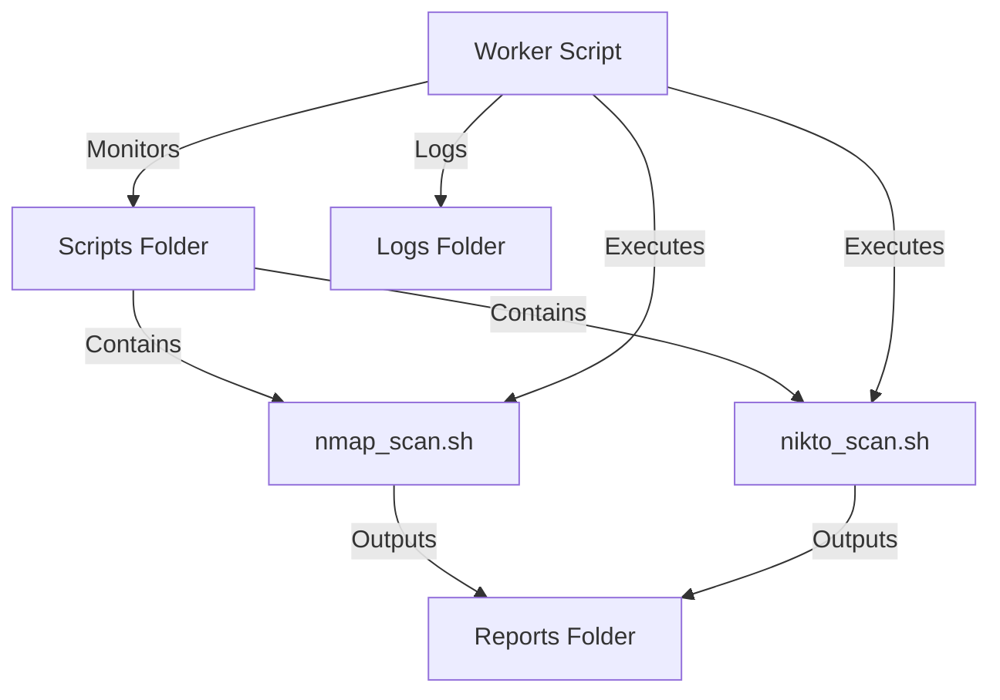

# Kali Linux Security Scanner Tool

A worker-based security scanning tool that monitors a folder for scripts and executes them using Kali Linux security tools.

## Architecture Overview



## Proposed Changes

### Project Structure

```
arch-sec/
├── worker.py           # Main worker script
├── config.yaml         # Configuration file
├── scripts/            # Security scripts folder (monitored)
│   ├── nmap_scan.sh    # Nmap network scanning
│   └── nikto_scan.sh   # Nikto web vulnerability scanning
├── reports/            # Output reports
└── logs/               # Worker logs
```

---

### Core Components

#### [NEW] [worker.py](file:///home/andres/Desktop/arch-sec/worker.py)

Python-based worker that:
- Monitors the `scripts/` folder for executable scripts
- Executes each script found in the folder
- Captures output and saves to `reports/` folder
- Logs all activity to `logs/` folder
- Supports scheduled/on-demand execution
- Handles script execution errors gracefully

#### [NEW] [config.yaml](file:///home/andres/Desktop/arch-sec/config.yaml)

Configuration file containing:
- Scripts directory path
- Reports directory path
- Scan interval settings
- Default targets (can be overridden per-script)

---

### Initial Security Scripts

#### [NEW] [scripts/nmap_scan.sh](file:///home/andres/Desktop/arch-sec/scripts/nmap_scan.sh)

Nmap network scanning script that:
- Performs host discovery
- Port scanning (common ports)
- Service/version detection
- Outputs XML and text reports

#### [NEW] [scripts/nikto_scan.sh](file:///home/andres/Desktop/arch-sec/scripts/nikto_scan.sh)

Nikto web vulnerability scanner that:
- Scans for web server vulnerabilities
- Checks for outdated software
- Identifies dangerous files/programs
- Outputs HTML and text reports

---

## Verification Plan

### Manual Testing

1. **Test Worker Script**
   - Run `python3 worker.py --help` to verify script loads correctly
   - Run `python3 worker.py --dry-run` to test without executing scripts
   - Verify logs are created in `logs/` folder

2. **Test Nmap Script**
   - Run `./scripts/nmap_scan.sh localhost` to test against local machine
   - Verify output report is created in `reports/` folder

3. **Test Nikto Script** (requires web server)
   - Run `./scripts/nikto_scan.sh http://localhost` against a local web server
   - Verify output report is created in `reports/` folder

> [!IMPORTANT]
> These scripts use Kali Linux security tools (nmap, nikto). Ensure they are installed on the system before testing.

> [!WARNING]
> **Only scan networks and systems you have explicit permission to test.** Unauthorized scanning may be illegal.
